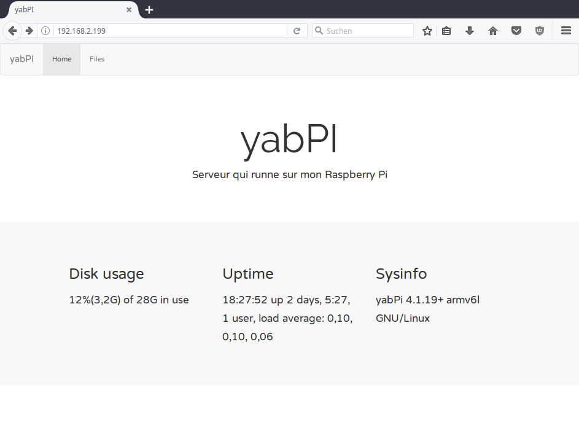

## Plain and simple status page for the Raspberry Pi

This can be installed on any Raspberry Pi running a web server with PHP module included.
It needs PHP because the python script that collects the system info every 30 seconds then assigns the collected data to PHP variables in the newly created file status.php.

The design of the status page is just plain bootstrap, simple and clean.
Google Web Fonts have been included.

### Installation

Clone this repo, edit file location in "interface.py" and run: python3 interface.py on your Raspberry.
